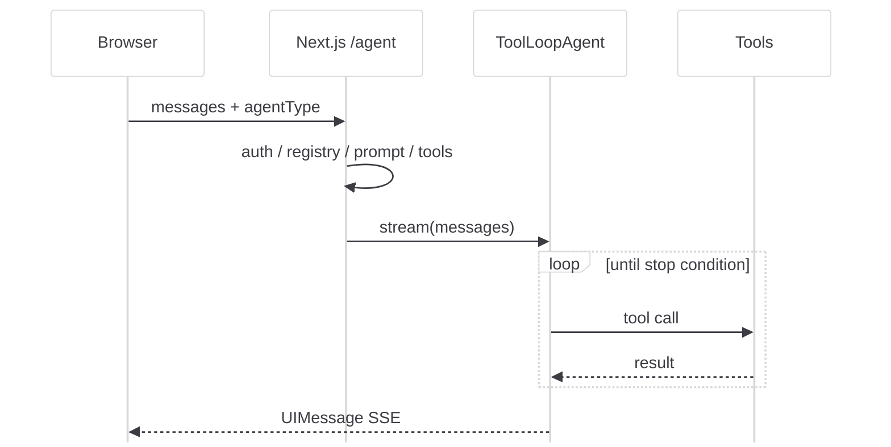
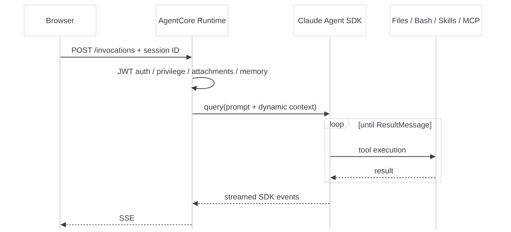

<div class="flex h-full flex-col justify-between">

<div class="flex items-center justify-between">
  <div class="muji-kicker">AIエージェント設計</div>
  <div class="muji-meta">2026 · 08 · TSUBOI HIROKI</div>
</div>

<div>
  <div class="muji-eyebrow mb-4">実装境界から考える</div>
  <h1>AIエージェントの<br>作り方</h1>
  <div class="muji-red-rule mt-7"></div>
  <p class="mt-6 text-xl max-w-[47rem]">
    ToolLoopAgent と Claude Agent SDK<br>
    <span class="text-base text-[#6d6d72]">公開実装に見る、2つの実装境界</span>
  </p>
</div>

<div class="muji-meta">
  公開リポジトリ · develop@e33b41b · 2026-08-07
</div>

</div>

<!--
この資料は公開リポジトリの設計を題材に、エージェントの「ループをどこに置くか」を説明する。

[Sources]
- https://github.com/mhigroup/A0005-AI-Workspace/tree/e33b41bea233d00e4c6b92da024e12cc412abcf5
-->

---
layout: default
---

<div class="muji-eyebrow mb-3">はじめに</div>

# 設計の本質は「2つのSDK」ではなく「2つの実行境界」

<div class="grid grid-cols-2 gap-10 mt-8">

<div class="border-t border-[#3c3c43] pt-5">
  <div class="muji-number">01</div>
  <div class="text-xl font-bold mt-3">Next.js がループを持つ</div>
  <p class="text-sm text-[#6d6d72] mt-2">
    AI SDK の <code>ToolLoopAgent</code> を共通 Route で生成。<br>
    エージェント差分はレジストリへ宣言する。
  </p>
</div>

<div class="border-t border-[#3c3c43] pt-5">
  <div class="muji-number">02</div>
  <div class="text-xl font-bold mt-3">Runtime がループを持つ</div>
  <p class="text-sm text-[#6d6d72] mt-2">
    AgentCore Runtime 内の Claude Agent SDK が<br>
    ツール実行・セッション・承認を制御する。
  </p>
</div>

</div>

<div class="muji-callout mt-9">
  <div class="text-lg font-bold">設計判断の起点は、モデルでもクラウドでもない。</div>
  <div class="text-sm text-[#6d6d72] mt-1">「誰が agent loop を所有するか」を先に決める。</div>
</div>

<div class="muji-folio">02 / 32</div>

<!--
`documents/エージェント追加手順ガイド.md` は ToolLoopAgent 系だけを対象とし、general-agent / mi-agent を明示的に別方式として除外している。

[Sources]
- https://github.com/mhigroup/A0005-AI-Workspace/blob/e33b41bea233d00e4c6b92da024e12cc412abcf5/documents/%E3%82%A8%E3%83%BC%E3%82%B8%E3%82%A7%E3%83%B3%E3%83%88%E8%BF%BD%E5%8A%A0%E6%89%8B%E9%A0%86%E3%82%AC%E3%82%A4%E3%83%89.md
- https://github.com/mhigroup/A0005-AI-Workspace/blob/e33b41bea233d00e4c6b92da024e12cc412abcf5/frontend/lib/agents/agentConfig.ts
-->

---
layout: default
---

<div class="muji-eyebrow mb-3">重要な区別</div>

# AgentCore Runtime を使う = その中に主役の agent がいる、とは限らない

<div class="grid grid-cols-[0.92fr_1.08fr] gap-8 mt-6">

<div class="muji-panel-kinari">
  <div class="muji-label">ツールとしてのRuntime</div>
  <div class="text-xl font-bold mt-3">ToolLoopAgent の配下</div>
  <p class="text-sm mt-3">
    AgentCore Runtime を MCP サーバーとして公開し、外側の ToolLoopAgent が <strong>1つの tool</strong> として呼ぶ。
  </p>
  <div class="muji-token">langfuse-agent</div>
  <div class="muji-token">nested loop</div>
</div>

<div class="muji-panel">
  <div class="muji-label">エージェント実行基盤としてのRuntime</div>
  <div class="text-xl font-bold mt-3">Claude Agent SDK が主役</div>
  <p class="text-sm mt-3">
    ブラウザが Runtime を直接 invoke。Runtime 内の SDK が agent loop、組み込みツール、Skills、MCP を所有する。
  </p>
  <div class="muji-token">general-agent</div>
  <div class="muji-token">mi-agent</div>
</div>

</div>

<blockquote class="mt-8">
<p>「AgentCore を使っているか」より、「AgentCore が何として接続されているか」を見る。</p>
</blockquote>

<div class="muji-folio">03 / 32</div>

<!--
AWS 公式も AgentCore Runtime を agent または tool のホストとして説明する。対象実装の langfuse-agent は Runtime を FastMCP サーバーとして公開し、外側の ToolLoopAgent から利用する。

[Sources]
- https://docs.aws.amazon.com/bedrock-agentcore/latest/devguide/agents-tools-runtime.html
- https://github.com/mhigroup/A0005-AI-Workspace/blob/e33b41bea233d00e4c6b92da024e12cc412abcf5/frontend/lib/mcp/agentCoreRuntimeClient.ts
- https://github.com/mhigroup/A0005-AI-Workspace/blob/e33b41bea233d00e4c6b92da024e12cc412abcf5/runtime/langfuse-agent/server.py
-->

---
layout: section
---

<div class="muji-kicker mb-6">01 · 全体構成</div>

# まず、全体を<br>一本の地図にする

<p class="muji-lead mt-7">同じエージェントメニューから選べても、送信後の経路は2本に分かれる。</p>

---
layout: default
---

<div class="muji-eyebrow mb-2">全体構成</div>

# UI は同じ。agent loop の置き場所が違う

<div class="muji-arch-entry mt-6"><strong>Chat UI</strong><span>→</span><code>selectedAgent</code></div>

<div class="mt-4 space-y-3">
  <div class="muji-arch-lane">
    <div class="muji-arch-index">A</div>
    <div class="muji-arch-box">Next.js <code>/agent</code></div><div class="muji-arch-arrow">→</div>
    <div class="muji-arch-box"><strong>ToolLoopAgent</strong></div><div class="muji-arch-arrow">→</div>
    <div class="muji-arch-box">MCP · local tools<br><span>Runtime as MCP tool</span></div>
  </div>
  <div class="muji-arch-lane">
    <div class="muji-arch-index">B</div>
    <div class="muji-arch-box">Direct transport</div><div class="muji-arch-arrow">→</div>
    <div class="muji-arch-box">AgentCore Runtime</div><div class="muji-arch-arrow">→</div>
    <div class="muji-arch-box"><strong>Claude Agent SDK</strong><br><span>Files · Bash · Skills · MCP</span></div>
  </div>
</div>

<div class="grid grid-cols-2 gap-8 mt-4 text-sm">
  <div class="muji-callout"><strong>左:</strong> Next.js の共通処理を最大限再利用する。</div>
  <div class="muji-callout"><strong>右:</strong> Runtime の実行環境と Agent SDK の機能を最大限使う。</div>
</div>

<div class="muji-folio">05 / 32</div>

<!--
[Sources]
- https://github.com/mhigroup/A0005-AI-Workspace/blob/e33b41bea233d00e4c6b92da024e12cc412abcf5/frontend/app/api/chat/histories/%5BhistoryId%5D/agent/route.ts
- https://github.com/mhigroup/A0005-AI-Workspace/blob/e33b41bea233d00e4c6b92da024e12cc412abcf5/frontend/lib/general-agent/transport.ts
- https://github.com/mhigroup/A0005-AI-Workspace/blob/e33b41bea233d00e4c6b92da024e12cc412abcf5/runtime/shared/chat/runtime_app.py
-->

---
layout: default
---

<div class="muji-eyebrow mb-2">実装経路の見分け方</div>

# 最短の見分け方は、直叩きリストを見ること

<div class="grid grid-cols-[1.08fr_0.92fr] gap-8 mt-7">

```ts {2-2,12-14}
export const DIRECT_INVOKE_AGENT_IDS = [
  "general-agent",
  "mi-agent",
] as const;

const INVOKE_URL_BY_AGENT = {
  "general-agent":
    process.env.NEXT_PUBLIC_GENERAL_AGENT_INVOKE_URL,
  "mi-agent":
    process.env.NEXT_PUBLIC_MI_AGENT_INVOKE_URL,
};

export function isDirectInvokeAgent(agentId?: string) {
  return DIRECT_INVOKE_AGENT_IDS.includes(agentId);
}
```

<div>
  <div class="muji-panel-kinari">
    <div class="muji-label">判断ルール</div>
    <div class="text-lg font-bold mt-2">リストにある2件だけが<br>Runtime 直叩き</div>
  </div>
  <div class="muji-step mt-5">
    <div class="muji-step-index">A</div>
    <div><div class="muji-step-title">それ以外</div><div class="muji-step-text">共通 `/agent` Route → ToolLoopAgent</div></div>
  </div>
  <div class="muji-step">
    <div class="muji-step-index">B</div>
    <div><div class="muji-step-title">general / mi</div><div class="muji-step-text">専用 transport → Runtime `/invocations`</div></div>
  </div>
</div>

</div>

<div class="muji-folio">06 / 32</div>

<!--
[Sources]
- https://github.com/mhigroup/A0005-AI-Workspace/blob/e33b41bea233d00e4c6b92da024e12cc412abcf5/frontend/lib/agents/agentConfig.ts
-->

---
layout: default
---

<div class="muji-eyebrow mb-2">実行境界の比較</div>

# 2方式の差は、共通機能の置き場所に現れる

| 観点 | ToolLoopAgent Route | Claude Agent SDK Runtime |
|---|---|---|
| loop の所有者 | Next.js / AI SDK | AgentCore Runtime / Agent SDK |
| エージェント差分 | TypeScript のレジストリ | Python の `AgentConfig` / options |
| ツール | Local TS・MCP・Runtime tool・Skills | Built-in tools・Skills・MCP |
| HITL | AI SDK tool approval + 共通 Route | `can_use_tool` + Runtime 側 queue |
| UI ストリーム | AI SDK `UIMessage` | SDK event → UI chunk 変換 |
| 会話継続 | DB の messages を再投入 | SDK session + S3 session store |
| デプロイ単位 | Web アプリ | Runtime コンテナ + Web アプリ配線 |

<div class="muji-callout mt-5">
  <div class="font-bold">同じ機能名でも、実装責任は共有されない。</div>
  <div class="muji-small mt-1">直叩き方式は、Next.js Route の共通ミドルウェアを通らない。</div>
</div>

<div class="muji-folio">07 / 32</div>

<!--
[Sources]
- https://github.com/mhigroup/A0005-AI-Workspace/blob/e33b41bea233d00e4c6b92da024e12cc412abcf5/.claude/rules/agent-capability-matrix.md
- https://github.com/mhigroup/A0005-AI-Workspace/blob/e33b41bea233d00e4c6b92da024e12cc412abcf5/runtime/general-agent/README.md
-->

---
layout: section
---

<div class="muji-kicker mb-6">02 · ToolLoopAgent方式</div>

# 共通 Route に<br>差分を宣言する

<p class="muji-lead mt-7">短い対話型エージェントを、既存のUI・認可・保存・観測へ最短で載せる。</p>

---
layout: default
---

<div class="muji-eyebrow mb-2">方式1</div>

# Next.js が agent loop を所有する

<div class="grid grid-cols-[1.12fr_0.88fr] gap-8 mt-6">



<div>
  <div class="muji-panel-kinari">
    <div class="muji-label">AI SDK</div>
    <div class="text-lg font-bold mt-2">反復を隠蔽する<br><code>ToolLoopAgent</code></div>
    <p class="muji-small mt-3">モデル → tool → 結果 → 再判断を、停止条件まで繰り返す。</p>
  </div>
  <div class="mt-5 text-sm">
    <div class="muji-step"><div class="muji-step-index">1</div><div><div class="muji-step-title">Route が組み立てる</div><div class="muji-step-text">prompt / tools / telemetry / approval</div></div></div>
    <div class="muji-step"><div class="muji-step-index">2</div><div><div class="muji-step-title">Agent が反復する</div><div class="muji-step-text">stopWhen まで自律的に tool を呼ぶ</div></div></div>
  </div>
</div>

</div>

<div class="muji-folio">09 / 32</div>

<!--
[Sources]
- https://ai-sdk.dev/docs/reference/ai-sdk-core/tool-loop-agent
- https://ai-sdk.dev/docs/agents/building-agents
- https://github.com/mhigroup/A0005-AI-Workspace/blob/e33b41bea233d00e4c6b92da024e12cc412abcf5/frontend/app/api/chat/histories/%5BhistoryId%5D/agent/route.ts
-->

---
layout: default
---

<div class="muji-eyebrow mb-2">宣言による定義</div>

# エージェント定義は3層に分ける

<div class="grid grid-cols-3 gap-5 mt-8">

<div class="border-t border-[#3c3c43] pt-5">
  <div class="muji-label">識別子</div>
  <div class="text-lg font-bold mt-2"><code>AGENT_IDS</code></div>
  <p class="muji-small mt-3">Zod enum。リクエストとクライアントが共有する正規ID。</p>
</div>

<div class="border-t border-[#3c3c43] pt-5">
  <div class="muji-label">振る舞い</div>
  <div class="text-lg font-bold mt-2"><code>AGENT_REGISTRY</code></div>
  <p class="muji-small mt-3">prompt、Gateway、保存戦略、telemetry、tool の宣言。</p>
</div>

<div class="border-t border-[#3c3c43] pt-5">
  <div class="muji-label">公開設定</div>
  <div class="text-lg font-bold mt-2">DynamoDB seed</div>
  <p class="muji-small mt-3"><code>enabled</code> と <code>privilege</code> の source of truth。</p>
</div>

</div>

<div class="muji-panel-kinari mt-9">
  <div class="grid grid-cols-[1fr_auto_1fr] items-center gap-6 text-center">
    <div><strong>型</strong><br><span class="muji-small">ID と Registry の欠落を検知</span></div>
    <div class="text-[#7f0019] text-2xl">×</div>
    <div><strong>データ</strong><br><span class="muji-small">表示と利用権限を運用で制御</span></div>
  </div>
</div>

<div class="muji-folio">10 / 32</div>

<!--
[Sources]
- https://github.com/mhigroup/A0005-AI-Workspace/blob/e33b41bea233d00e4c6b92da024e12cc412abcf5/documents/%E3%82%A8%E3%83%BC%E3%82%B8%E3%82%A7%E3%83%B3%E3%83%88%E8%BF%BD%E5%8A%A0%E6%89%8B%E9%A0%86%E3%82%AC%E3%82%A4%E3%83%89.md
- https://github.com/mhigroup/A0005-AI-Workspace/blob/e33b41bea233d00e4c6b92da024e12cc412abcf5/frontend/schemas/api/agents.ts
- https://github.com/mhigroup/A0005-AI-Workspace/blob/e33b41bea233d00e4c6b92da024e12cc412abcf5/terraform/modules/dynamo/agents/variables.tf
-->

---
layout: default
---

<div class="muji-eyebrow mb-2">追加手順</div>

# 追加作業は「共通 Route を編集しない」順番で進める

<div class="grid grid-cols-2 gap-x-9 mt-5">

<div>
  <div class="muji-step"><div class="muji-step-index">01</div><div><div class="muji-step-title">ID を追加</div><div class="muji-step-text"><code>schemas/api/agents.ts</code></div></div></div>
  <div class="muji-step"><div class="muji-step-index">02</div><div><div class="muji-step-title">System prompt を分離</div><div class="muji-step-text">静的 prefix / 動的 context</div></div></div>
  <div class="muji-step"><div class="muji-step-index">03</div><div><div class="muji-step-title">Registry に宣言</div><div class="muji-step-text">gateways / tools / telemetry / catalog</div></div></div>
</div>

<div>
  <div class="muji-step"><div class="muji-step-index">04</div><div><div class="muji-step-title">表示・権限を seed</div><div class="muji-step-text">DynamoDB agents table</div></div></div>
  <div class="muji-step"><div class="muji-step-index">05</div><div><div class="muji-step-title">テストを追随</div><div class="muji-step-text">prompt mock / tool permission / route</div></div></div>
  <div class="muji-step"><div class="muji-step-index">06</div><div><div class="muji-step-title">画面で DoD を確認</div><div class="muji-step-text">表示 → chat → tool call</div></div></div>
</div>

</div>

<div class="muji-callout mt-6">
  <strong>最後に capability matrix を更新。</strong>
  <span class="muji-small ml-2">「実装した」だけでなく「何が効くか」を運用可能な形で残す。</span>
</div>

<div class="muji-folio">11 / 32</div>

<!--
元ガイドは Step 1〜7 と、tool 接続の条件付き手順を12項目のチェックリストに整理している。ここでは外部説明用に6工程へ圧縮した。

[Sources]
- https://github.com/mhigroup/A0005-AI-Workspace/blob/e33b41bea233d00e4c6b92da024e12cc412abcf5/documents/%E3%82%A8%E3%83%BC%E3%82%B8%E3%82%A7%E3%83%B3%E3%83%88%E8%BF%BD%E5%8A%A0%E6%89%8B%E9%A0%86%E3%82%AC%E3%82%A4%E3%83%89.md
-->

---
layout: default
---

<div class="muji-eyebrow mb-2">実装の中核</div>

# ToolLoopAgent の設定が、実行契約になる

<div class="grid grid-cols-[1.12fr_0.88fr] gap-8 mt-5">

```ts {3,5-7,9-13}
new ToolLoopAgent({
  id: `mhi-${agentType}`,
  model: languageModel,
  instructions: buildCachedSystemMessage(...),
  stopWhen: isStepCount(maxSteps ?? 10),
  tools: agentTools,
  toolApproval: ({ toolCall }) =>
    destructiveToolNames.has(toolCall.toolName)
      ? "user-approval"
      : undefined,
  providerOptions: getReasoningOptions(model),
  prepareStep: ({ messages }) => ({
    messages: stripInvalidReasoningSignatures(messages),
  }),
  onStepEnd,
  onEnd: onAgentFinish,
})
```

<div>
  <div class="muji-step"><div class="muji-step-index">A</div><div><div class="muji-step-title">停止条件</div><div class="muji-step-text">無制限ループを避ける</div></div></div>
  <div class="muji-step"><div class="muji-step-index">B</div><div><div class="muji-step-title">承認ポリシー</div><div class="muji-step-text">破壊的 tool を実行前に止める</div></div></div>
  <div class="muji-step"><div class="muji-step-index">C</div><div><div class="muji-step-title">step callback</div><div class="muji-step-text">観測、参照、UI stage を集約</div></div></div>
  <div class="muji-step"><div class="muji-step-index">D</div><div><div class="muji-step-title">finish callback</div><div class="muji-step-text">保存、cleanup、refusal を集約</div></div></div>
</div>

</div>

<div class="muji-folio">12 / 32</div>

<!--
[Sources]
- https://ai-sdk.dev/docs/reference/ai-sdk-core/tool-loop-agent
- https://github.com/mhigroup/A0005-AI-Workspace/blob/e33b41bea233d00e4c6b92da024e12cc412abcf5/frontend/app/api/chat/histories/%5BhistoryId%5D/agent/route.ts
-->

---
layout: default
---

<div class="muji-eyebrow mb-2">ツールの集約</div>

# 4つの入口を、1つの tool set に集約する

<div class="grid grid-cols-4 gap-4 mt-8">

<div class="border-t border-[#3c3c43] pt-4">
  <div class="muji-label">MCPツール</div>
  <div class="font-bold mt-2">Gateway tools</div>
  <p class="muji-small mt-2">RAG、DynamoDB、kintone など</p>
</div>

<div class="border-t border-[#3c3c43] pt-4">
  <div class="muji-label">Runtimeツール</div>
  <div class="font-bold mt-2"><code>buildRuntimeTools</code></div>
  <p class="muji-small mt-2">Local TS または AgentCore Runtime</p>
</div>

<div class="border-t border-[#3c3c43] pt-4">
  <div class="muji-label">Skillsツール</div>
  <div class="font-bold mt-2">Skill tools</div>
  <p class="muji-small mt-2">事前選択・動的ロード</p>
</div>

<div class="border-t border-[#3c3c43] pt-4">
  <div class="muji-label">機能ツール</div>
  <div class="font-bold mt-2">Local feature tools</div>
  <p class="muji-small mt-2">画像生成・Web検索</p>
</div>

</div>

<div class="mt-8 px-6 py-5 bg-[#f4eede] border border-[#e0ceaa]">
  <div class="grid grid-cols-[1fr_auto_1fr_auto_1fr] items-center text-center gap-4">
    <div><strong>merge</strong><br><span class="muji-small">同名衝突と分類</span></div>
    <div class="text-[#7f0019] text-2xl">→</div>
    <div><strong>wrap</strong><br><span class="muji-small">stage通知とHITL</span></div>
    <div class="text-[#7f0019] text-2xl">→</div>
    <div><strong>ToolLoopAgent</strong><br><span class="muji-small">単一の実行面</span></div>
  </div>
</div>

<div class="muji-folio">13 / 32</div>

<!--
[Sources]
- https://github.com/mhigroup/A0005-AI-Workspace/blob/e33b41bea233d00e4c6b92da024e12cc412abcf5/frontend/app/api/chat/histories/%5BhistoryId%5D/agent/route.ts
- https://github.com/mhigroup/A0005-AI-Workspace/blob/e33b41bea233d00e4c6b92da024e12cc412abcf5/frontend/app/api/chat/histories/%5BhistoryId%5D/agent/_utils/tools.ts
-->

---
layout: default
---

<div class="muji-eyebrow mb-2">ハイブリッド構成</div>

# AgentCore Runtime を「agent tool」として挟むケース

<div class="muji-arch-lane muji-arch-lane-four mt-6">
  <div class="muji-arch-box"><span>外側</span><br><strong>ToolLoopAgent</strong></div><div class="muji-arch-arrow">→</div>
  <div class="muji-arch-box"><span>MCP境界</span><br>AI SDK MCP client</div><div class="muji-arch-arrow">→</div>
  <div class="muji-arch-box"><span>AgentCore Runtime</span><br><strong>FastMCP · invoke</strong></div><div class="muji-arch-arrow">→</div>
  <div class="muji-arch-box"><span>内側</span><br>Strands Agent · Langfuse tools</div>
</div>

<div class="grid grid-cols-3 gap-5 mt-6">
  <div class="muji-panel"><div class="muji-label">外側</div><div class="font-bold mt-2">会話とUIの責任</div><div class="muji-small mt-2">履歴、承認、ストリーム、保存</div></div>
  <div class="muji-panel-kinari"><div class="muji-label">境界</div><div class="font-bold mt-2">MCP の <code>invoke</code></div><div class="muji-small mt-2">Runtime 全体が1つの tool に見える</div></div>
  <div class="muji-panel"><div class="muji-label">内側</div><div class="font-bold mt-2">専門分析の責任</div><div class="muji-small mt-2">専門 prompt と下流 tools の選択</div></div>
</div>

<div class="muji-callout mt-5">
  <strong>これは第3の追加方式ではない。</strong>
  <span class="muji-small ml-2">外側は依然として ToolLoopAgent 方式。内側の能力だけを Runtime へ委譲する。</span>
</div>

<div class="muji-folio">14 / 32</div>

<!--
[Sources]
- https://github.com/mhigroup/A0005-AI-Workspace/blob/e33b41bea233d00e4c6b92da024e12cc412abcf5/frontend/app/api/chat/histories/%5BhistoryId%5D/agent/agentRegistry.ts
- https://github.com/mhigroup/A0005-AI-Workspace/blob/e33b41bea233d00e4c6b92da024e12cc412abcf5/frontend/lib/mcp/agentCoreRuntimeClient.ts
- https://github.com/mhigroup/A0005-AI-Workspace/blob/e33b41bea233d00e4c6b92da024e12cc412abcf5/runtime/langfuse-agent/server.py
- https://github.com/mhigroup/A0005-AI-Workspace/blob/e33b41bea233d00e4c6b92da024e12cc412abcf5/runtime/langfuse-agent/agent.py
-->

---
layout: default
---

<div class="muji-eyebrow mb-2">共通機能</div>

# 共通 Route の価値は「agent loop 以外」にある

<div class="grid grid-cols-2 gap-8 mt-6">

<div>
  <div class="muji-label mb-2">共通Routeで自動適用</div>
  <div class="muji-step"><div class="muji-step-index">✓</div><div><div class="muji-step-title">認証・権限・rate limit</div></div></div>
  <div class="muji-step"><div class="muji-step-index">✓</div><div><div class="muji-step-title">チャット履歴・タイトル保存</div></div></div>
  <div class="muji-step"><div class="muji-step-index">✓</div><div><div class="muji-step-title">reasoning・prompt cache</div></div></div>
  <div class="muji-step"><div class="muji-step-index">✓</div><div><div class="muji-step-title">refusal・telemetry・cleanup</div></div></div>
</div>

<div>
  <div class="muji-label mb-2">レジストリから有効化</div>
  <div class="muji-step"><div class="muji-step-index">+</div><div><div class="muji-step-title">MCP Gateway / runtime tools</div></div></div>
  <div class="muji-step"><div class="muji-step-index">+</div><div><div class="muji-step-title">RAG references / response strategy</div></div></div>
  <div class="muji-step"><div class="muji-step-index">+</div><div><div class="muji-step-title">image generation / web search</div></div></div>
  <div class="muji-step"><div class="muji-step-index">+</div><div><div class="muji-step-title">json-render catalog</div></div></div>
</div>

</div>

<div class="muji-panel-kinari mt-6">
  <strong>新規エージェントは、成熟した実行基盤へ「差分だけ」を追加できる。</strong>
</div>

<div class="muji-folio">15 / 32</div>

<!--
[Sources]
- https://github.com/mhigroup/A0005-AI-Workspace/blob/e33b41bea233d00e4c6b92da024e12cc412abcf5/documents/%E3%82%A8%E3%83%BC%E3%82%B8%E3%82%A7%E3%83%B3%E3%83%88%E8%BF%BD%E5%8A%A0%E6%89%8B%E9%A0%86%E3%82%AC%E3%82%A4%E3%83%89.md
- https://github.com/mhigroup/A0005-AI-Workspace/blob/e33b41bea233d00e4c6b92da024e12cc412abcf5/.claude/rules/agent-capability-matrix.md
-->

---
layout: default
---

<div class="muji-eyebrow mb-2">ツール接続</div>

# ツールの接続は、既存資産から外側へ広げる

<div class="grid grid-cols-3 gap-6 mt-8">

<div class="border-t border-[#3c3c43] pt-5">
  <div class="muji-number">1</div>
  <div class="text-lg font-bold mt-2">Local TS tool</div>
  <p class="muji-small mt-2">外部API不要。<code>tool()</code> + schema を <code>buildRuntimeTools</code> から返す。</p>
</div>

<div class="border-t border-[#3c3c43] pt-5">
  <div class="muji-number">2</div>
  <div class="text-lg font-bold mt-2">Existing MCP Gateway</div>
  <p class="muji-small mt-2">既存ツールで足りる。Registry の <code>gateways</code> にキーを追加。</p>
</div>

<div class="border-t border-[#3c3c43] pt-5">
  <div class="muji-number">3</div>
  <div class="text-lg font-bold mt-2">New MCP Gateway</div>
  <p class="muji-small mt-2">新しい外部連携。Lambda・認証・認可・Terraform・env まで作る。</p>
</div>

</div>

<div class="muji-callout mt-9">
  <div class="font-bold">選定順序: Local → Existing Gateway → New Gateway</div>
  <div class="muji-small mt-1">境界を増やすほど、認証・障害・デプロイ・観測の責任も増える。</div>
</div>

<div class="muji-folio">16 / 32</div>

<!--
[Sources]
- https://github.com/mhigroup/A0005-AI-Workspace/blob/e33b41bea233d00e4c6b92da024e12cc412abcf5/documents/%E3%82%A8%E3%83%BC%E3%82%B8%E3%82%A7%E3%83%B3%E3%83%88%E8%BF%BD%E5%8A%A0%E6%89%8B%E9%A0%86%E3%82%AC%E3%82%A4%E3%83%89.md
-->

---
layout: default
---

<div class="muji-eyebrow mb-2">適用判断</div>

# ToolLoopAgent 方式は「共通基盤に乗る専門家」に向く

<div class="grid grid-cols-[1fr_1fr] gap-10 mt-8">

<div>
  <div class="muji-label mb-3">適している場合</div>
  <ul>
    <li>1回のHTTPストリームで完結する対話が中心</li>
    <li>既存MCPやローカルtoolを組み合わせたい</li>
    <li>UI・保存・認可・観測を共通化したい</li>
    <li>TypeScriptで差分を小さく保ちたい</li>
  </ul>
</div>

<div>
  <div class="muji-label mb-3">再検討する場合</div>
  <ul>
    <li>ローカルファイルやBashを主体に作業する</li>
    <li>Skillsやsubagentを実行基盤の中で使いたい</li>
    <li>長いセッションをRuntimeへ閉じ込めたい</li>
    <li>独立したコンテナ依存・ライブラリが必要</li>
  </ul>
</div>

</div>

<div class="muji-panel-kinari mt-8">
  <div class="text-lg font-bold">専門性は prompt と tools へ。運用責任は共通 Route へ。</div>
</div>

<div class="muji-folio">17 / 32</div>

<!--
このスライドは対象実装の実行境界から導いた選定指針。

[Sources]
- https://github.com/mhigroup/A0005-AI-Workspace/blob/e33b41bea233d00e4c6b92da024e12cc412abcf5/documents/%E3%82%A8%E3%83%BC%E3%82%B8%E3%82%A7%E3%83%B3%E3%83%88%E8%BF%BD%E5%8A%A0%E6%89%8B%E9%A0%86%E3%82%AC%E3%82%A4%E3%83%89.md
- https://ai-sdk.dev/docs/agents/building-agents
-->

---
layout: section
---

<div class="muji-kicker mb-6">03 · Claude Agent SDK方式</div>

# Runtime そのものを<br>エージェントにする

<p class="muji-lead mt-7">ファイル、コマンド、Skills、長いセッションを、隔離された実行環境の中で扱う。</p>

---
layout: default
---

<div class="muji-eyebrow mb-2">方式2</div>

# AgentCore Runtime が agent loop を所有する



<div class="muji-runtime-band mt-2">
  <div><span>実行基盤</span><strong>AgentCore Runtime</strong></div>
  <div><span>ループ</span><strong>Claude Agent SDK</strong></div>
  <div><span>モデル経路</span><strong>Amazon Bedrock</strong></div>
</div>

<div class="muji-folio">19 / 32</div>

<!--
[Sources]
- https://code.claude.com/docs/en/agent-sdk/agent-loop
- https://docs.aws.amazon.com/bedrock-agentcore/latest/devguide/runtime-how-it-works.html
- https://github.com/mhigroup/A0005-AI-Workspace/blob/e33b41bea233d00e4c6b92da024e12cc412abcf5/runtime/general-agent/README.md
-->

---
layout: default
---

<div class="muji-eyebrow mb-2">フロントエンド境界</div>

# ブラウザは Next.js の agent Route を通らない

<div class="grid grid-cols-[1.08fr_0.92fr] gap-8 mt-6">

```ts {1-3,9-13}
// Direct Runtime invocation
fetch(invokeUrl, {
  method: "POST",
  headers: {
    Authorization: `Bearer ${idToken}`,
    "Content-Type": "application/json",
    "X-Amzn-Bedrock-AgentCore-Runtime-Session-Id":
      sessionId,
  },
  body: JSON.stringify({
    prompt,
    chatHistoryId,
    attachments,
  }),
})
```

<div>
  <div class="muji-step"><div class="muji-step-index">1</div><div><div class="muji-step-title">ID token を取得</div><div class="muji-step-text">期限前に refresh、401/403 は再取得</div></div></div>
  <div class="muji-step"><div class="muji-step-index">2</div><div><div class="muji-step-title">session ID を固定</div><div class="muji-step-text">同じ会話を同じ Runtime session へ</div></div></div>
  <div class="muji-step"><div class="muji-step-index">3</div><div><div class="muji-step-title">SSE を変換</div><div class="muji-step-text">SDK event → AI SDK UIMessageChunk</div></div></div>
  <div class="muji-step"><div class="muji-step-index">4</div><div><div class="muji-step-title">履歴だけ別 Route へ</div><div class="muji-step-text">表示用DBを checkpoint / persist</div></div></div>
</div>

</div>

<div class="muji-folio">20 / 32</div>

<!--
[Sources]
- https://github.com/mhigroup/A0005-AI-Workspace/blob/e33b41bea233d00e4c6b92da024e12cc412abcf5/frontend/lib/general-agent/transport.ts
- https://github.com/mhigroup/A0005-AI-Workspace/blob/e33b41bea233d00e4c6b92da024e12cc412abcf5/frontend/lib/general-agent/sseAdapter.ts
-->

---
layout: default
---

<div class="muji-eyebrow mb-2">Runtimeの構成</div>

# Runtime は4つの責務に分ける

<div class="grid grid-cols-2 gap-x-8 gap-y-5 mt-7">

<div class="border-t border-[#3c3c43] pt-4">
  <div class="muji-label">01 · 入口</div>
  <div class="text-lg font-bold mt-2"><code>server_app.py</code></div>
  <p class="muji-small mt-2">BedrockAgentCoreApp、JWT、privilege、SSE entrypoint。</p>
</div>

<div class="border-t border-[#3c3c43] pt-4">
  <div class="muji-label">02 · エージェント固有</div>
  <div class="text-lg font-bold mt-2"><code>agent.py</code></div>
  <p class="muji-small mt-2">model、system prompt、Skills、MCP、permission、session store。</p>
</div>

<div class="border-t border-[#3c3c43] pt-4">
  <div class="muji-label">03 · 共有ループ</div>
  <div class="text-lg font-bold mt-2"><code>runtime_app.py</code></div>
  <p class="muji-small mt-2"><code>ClaudeSDKClient</code>、query、event loop、memory、HITL queue。</p>
</div>

<div class="border-t border-[#3c3c43] pt-4">
  <div class="muji-label">04 · コンテナ</div>
  <div class="text-lg font-bold mt-2"><code>Dockerfile + Terraform</code></div>
  <p class="muji-small mt-2">CLI binary、Python依存、IAM、ネットワーク、Runtime version。</p>
</div>

</div>

<div class="muji-panel-kinari mt-6">
  <strong>新しい agent は、共有 loop を再実装せず AgentConfig を差し替える。</strong>
</div>

<div class="muji-folio">21 / 32</div>

<!--
[Sources]
- https://github.com/mhigroup/A0005-AI-Workspace/blob/e33b41bea233d00e4c6b92da024e12cc412abcf5/runtime/shared/chat/server_app.py
- https://github.com/mhigroup/A0005-AI-Workspace/blob/e33b41bea233d00e4c6b92da024e12cc412abcf5/runtime/shared/chat/runtime_app.py
- https://github.com/mhigroup/A0005-AI-Workspace/blob/e33b41bea233d00e4c6b92da024e12cc412abcf5/runtime/general-agent/agent.py
- https://github.com/mhigroup/A0005-AI-Workspace/blob/e33b41bea233d00e4c6b92da024e12cc412abcf5/runtime/general-agent/Dockerfile
-->

---
layout: default
---

<div class="muji-eyebrow mb-2">SDKが提供するもの</div>

# Claude Agent SDK は、Claude Code の実行能力をライブラリ化する

<div class="grid grid-cols-3 gap-5 mt-7">

<div class="muji-panel">
  <div class="muji-label">組み込みツール</div>
  <div class="font-bold mt-2">Read · Edit · Write<br>Glob · Grep · Bash</div>
  <p class="muji-small mt-3">ファイルとコマンドを同じ loop 内で扱う。</p>
</div>

<div class="muji-panel-kinari">
  <div class="muji-label">再利用する振る舞い</div>
  <div class="font-bold mt-2">Skills · MCP<br>Subagents · Hooks</div>
  <p class="muji-small mt-3">能力とワークフローを実行環境に同梱する。</p>
</div>

<div class="muji-panel">
  <div class="muji-label">制御</div>
  <div class="font-bold mt-2">Permissions · Budget<br>Session · Streaming</div>
  <p class="muji-small mt-3">実行可否、上限、継続、進捗をアプリから制御する。</p>
</div>

</div>

<div class="muji-callout mt-8">
  <div class="font-bold">SDK が tool call と result の反復を進める。</div>
  <div class="muji-small mt-1">アプリ側は message stream、承認、セッション、成果物の扱いを設計する。</div>
</div>

<div class="muji-folio">22 / 32</div>

<!--
[Sources]
- https://code.claude.com/docs/en/agent-sdk/overview
- https://code.claude.com/docs/en/agent-sdk/agent-loop
- https://code.claude.com/docs/en/agent-sdk/skills
- https://code.claude.com/docs/en/agent-sdk/permissions
-->

---
layout: default
---

<div class="muji-eyebrow mb-2">AgentCoreが提供するもの</div>

# AgentCore Runtime は、<br>agent loop に運用境界を与える

<div class="grid grid-cols-2 gap-8 mt-7">

<div>
  <div class="muji-step"><div class="muji-step-index">01</div><div><div class="muji-step-title">Session isolation</div><div class="muji-step-text">ユーザーセッションごとに隔離されたCPU・メモリ・ファイルシステム。</div></div></div>
  <div class="muji-step"><div class="muji-step-index">02</div><div><div class="muji-step-title">Streaming protocol</div><div class="muji-step-text">HTTP / WebSocket で長い応答を段階的に返す。</div></div></div>
  <div class="muji-step"><div class="muji-step-index">03</div><div><div class="muji-step-title">Versioned runtime</div><div class="muji-step-text">コンテナと設定をversion化し、endpointで切り替える。</div></div></div>
</div>

<div>
  <div class="muji-step"><div class="muji-step-index">04</div><div><div class="muji-step-title">Identity & authorization</div><div class="muji-step-text">Inbound JWT / IAM と outbound access を境界化。</div></div></div>
  <div class="muji-step"><div class="muji-step-index">05</div><div><div class="muji-step-title">Observability</div><div class="muji-step-text">model interaction と tool invocation を追跡する。</div></div></div>
  <div class="muji-step"><div class="muji-step-index">06</div><div><div class="muji-step-title">Framework agnostic</div><div class="muji-step-text">Claude Agent SDK 以外の agent / tool もホストできる。</div></div></div>
</div>

</div>

<div class="muji-panel-kinari mt-6">
  <strong>SDK は agent の実行論。AgentCore は agent の運用論。</strong>
</div>

<div class="muji-folio">23 / 32</div>

<!--
[Sources]
- https://docs.aws.amazon.com/bedrock-agentcore/latest/devguide/agents-tools-runtime.html
- https://docs.aws.amazon.com/bedrock-agentcore/latest/devguide/runtime-how-it-works.html
-->

---
layout: default
---

<div class="muji-eyebrow mb-2">追加手順</div>

# 直叩き agent の追加は、アプリ追加<br>ではなく Runtime 追加に近い

<div class="grid grid-cols-2 gap-x-9 mt-5">

<div>
  <div class="muji-step"><div class="muji-step-index">01</div><div><div class="muji-step-title">専用ディレクトリを作る</div><div class="muji-step-text"><code>runtime/&lt;agent&gt;/</code></div></div></div>
  <div class="muji-step"><div class="muji-step-index">02</div><div><div class="muji-step-title">AgentConfig を実装</div><div class="muji-step-text">options / turn header / cache key</div></div></div>
  <div class="muji-step"><div class="muji-step-index">03</div><div><div class="muji-step-title">Tools・Skills・MCPを閉じる</div><div class="muji-step-text">allow / deny / can_use_tool</div></div></div>
  <div class="muji-step"><div class="muji-step-index">04</div><div><div class="muji-step-title">共有 server / loop に接続</div><div class="muji-step-text">entrypoint と event stream</div></div></div>
</div>

<div>
  <div class="muji-step"><div class="muji-step-index">05</div><div><div class="muji-step-title">コンテナを固定</div><div class="muji-step-text">CLI binary / Python / OS dependencies</div></div></div>
  <div class="muji-step"><div class="muji-step-index">06</div><div><div class="muji-step-title">AgentCore を配備</div><div class="muji-step-text">IAM / auth / network / env / version</div></div></div>
  <div class="muji-step"><div class="muji-step-index">07</div><div><div class="muji-step-title">Frontend を直叩き配線</div><div class="muji-step-text">invoke URL / transport / SSE adapter / persist</div></div></div>
</div>

</div>

<div class="muji-callout mt-3">
  <strong>検証単位も2つ。</strong><span class="muji-small ml-2">Runtime の pytest と、Frontend の streaming / persist / HITL。</span>
</div>

<div class="muji-folio">24 / 32</div>

<!--
対象リポジトリには ToolLoopAgent 系のような単一追加ガイドはなく、general-agent の README と共有 runtime 実装が実質的な参照実装になっている。このスライドはその構造を外部向け手順に再構成したもの。

[Sources]
- https://github.com/mhigroup/A0005-AI-Workspace/blob/e33b41bea233d00e4c6b92da024e12cc412abcf5/runtime/general-agent/README.md
- https://github.com/mhigroup/A0005-AI-Workspace/tree/e33b41bea233d00e4c6b92da024e12cc412abcf5/runtime/shared/chat
- https://github.com/mhigroup/A0005-AI-Workspace/blob/e33b41bea233d00e4c6b92da024e12cc412abcf5/frontend/lib/agents/agentConfig.ts
-->

---
layout: default
---

<div class="muji-eyebrow mb-2">状態・継続・耐久性</div>

# 「session を復元できる」と「処理を再開できる」は違う

<div class="grid grid-cols-3 gap-5 mt-7">

<div class="muji-panel">
  <div class="muji-label">会話</div>
  <div class="text-lg font-bold mt-2">S3 session store</div>
  <p class="muji-small mt-3">SDK transcript を外部保存し、別 host から同じ session を resume。</p>
</div>

<div class="muji-panel-kinari">
  <div class="muji-label">画面表示</div>
  <div class="text-lg font-bold mt-2">DB checkpoints</div>
  <p class="muji-small mt-3">画面に見せた途中回答・HITLカード・最終回答を別経路で保存。</p>
</div>

<div class="muji-panel">
  <div class="muji-label">実行中の状態</div>
  <div class="text-lg font-bold mt-2">Memory queue</div>
  <p class="muji-small mt-3">承認待ち queue や実行中 tool は、プロセス停止でそのまま戻らない。</p>
</div>

</div>

<blockquote class="mt-7">
<p>履歴の continuity と、step の durability を分けて設計する。</p>
</blockquote>

<div class="muji-folio">25 / 32</div>

<!--
Claude Agent SDK は sessionStore adapter で transcript を外部保存し stateless host から resume できる。対象実装は S3SessionStore を使う。一方、HITL は Runtime プロセス内 queue で待つため、queue 自体は外部永続化されない。

[Sources]
- https://code.claude.com/docs/en/agent-sdk/session-storage
- https://code.claude.com/docs/en/agent-sdk/sessions
- https://code.claude.com/docs/en/agent-sdk/user-input
- https://github.com/mhigroup/A0005-AI-Workspace/blob/e33b41bea233d00e4c6b92da024e12cc412abcf5/runtime/shared/chat/session_store.py
- https://github.com/mhigroup/A0005-AI-Workspace/blob/e33b41bea233d00e4c6b92da024e12cc412abcf5/runtime/shared/chat/hitl.py
-->

---
layout: section
---

<div class="muji-kicker mb-6">04 · 選択基準</div>

# 2方式は競合ではなく<br>役割分担である

<p class="muji-lead mt-7">実装の小ささ、実行環境の強さ、運用責任の置き場所を比較する。</p>

---
layout: default
class: compact-matrix
---

<div class="muji-eyebrow mb-2">判断基準</div>

# 選ぶ基準は「必要な実行環境」と「共有したい責任」

| 要件 | ToolLoopAgent Route | Claude Agent SDK Runtime |
|---|:---:|:---:|
| 既存UI・保存・認可へ最短で追加 | ◎ | △ |
| TypeScriptだけで完結 | ◎ | — |
| Local TS / MCP tool の合成 | ◎ | ○ |
| Read / Edit / Bash の組み込み実行 | △ | ◎ |
| Skills / subagents / hooks | △ | ◎ |
| 独自Python・OS依存の同梱 | △ | ◎ |
| コンテナ・IAM・network運用を避けたい | ◎ | — |
| Runtime session に作業状態を閉じたい | △ | ◎ |

<div class="muji-callout mt-3">
  <strong>迷ったら ToolLoopAgent から始める。</strong>
  <span class="muji-small ml-2">実行環境そのものが要件になった時点で Runtime 方式へ。</span>
</div>

<div class="muji-folio">27 / 32</div>

<!--
この比較は対象実装と、両SDK・AgentCoreの公式ドキュメントを合わせた設計上の整理。

[Sources]
- https://ai-sdk.dev/docs/agents/building-agents
- https://code.claude.com/docs/en/agent-sdk/overview
- https://code.claude.com/docs/en/agent-sdk/hosting
- https://docs.aws.amazon.com/bedrock-agentcore/latest/devguide/agents-tools-runtime.html
-->

---
layout: default
---

<div class="muji-eyebrow mb-2">判断の順序</div>

# 先に loop の置き場所を決める

<div class="grid grid-cols-3 gap-5 mt-7">
  <div class="muji-decision-card">
    <div class="muji-number">1</div>
    <div class="muji-label mt-3">実行環境</div>
    <div class="font-bold mt-2">Files · Bash · Skills が主役か</div>
    <div class="muji-decision-result"><span>該当</span> Claude Agent SDK<br>AgentCore Runtime 上</div>
  </div>
  <div class="muji-decision-card">
    <div class="muji-number">2</div>
    <div class="muji-label mt-3">共有責任</div>
    <div class="font-bold mt-2">既存UI・保存・認可を使うか</div>
    <div class="muji-decision-result"><span>該当</span> ToolLoopAgent 共通Route</div>
  </div>
  <div class="muji-decision-card">
    <div class="muji-number">3</div>
    <div class="muji-label mt-3">ハイブリッド</div>
    <div class="font-bold mt-2">専門処理だけを外へ出すか</div>
    <div class="muji-decision-result"><span>該当</span> MCP toolとしてのRuntime</div>
  </div>
</div>

<div class="muji-panel-kinari mt-5 text-center">
  <strong>Runtime を使うかどうかは、最後に決まる。</strong>
</div>

<div class="muji-folio">28 / 32</div>

<!--
このフローは本資料の調査結果から導いた推奨判断順序。

[Sources]
- https://github.com/mhigroup/A0005-AI-Workspace/blob/e33b41bea233d00e4c6b92da024e12cc412abcf5/documents/%E3%82%A8%E3%83%BC%E3%82%B8%E3%82%A7%E3%83%B3%E3%83%88%E8%BF%BD%E5%8A%A0%E6%89%8B%E9%A0%86%E3%82%AC%E3%82%A4%E3%83%89.md
- https://github.com/mhigroup/A0005-AI-Workspace/blob/e33b41bea233d00e4c6b92da024e12cc412abcf5/runtime/general-agent/README.md
-->

---
layout: default
---

<div class="muji-eyebrow mb-2">共通の設計原則</div>

# 方式が違っても、守る原則は同じ

<div class="grid grid-cols-3 gap-6 mt-8">

<div class="border-t border-[#3c3c43] pt-5">
  <div class="muji-label">認証・認可</div>
  <div class="text-lg font-bold mt-2">誰の権限で動くか</div>
  <p class="muji-small mt-2">ユーザーJWT、Runtime role、下流サービスの認可を混ぜない。</p>
</div>

<div class="border-t border-[#3c3c43] pt-5">
  <div class="muji-label">ツール境界</div>
  <div class="text-lg font-bold mt-2">見せるtoolを最小化</div>
  <p class="muji-small mt-2">命名、schema、read-only hint、allow / deny を設計する。</p>
</div>

<div class="border-t border-[#3c3c43] pt-5">
  <div class="muji-label">人による制御</div>
  <div class="text-lg font-bold mt-2">副作用前に承認する</div>
  <p class="muji-small mt-2">HITL を UI 表示ではなく実行契約として扱う。</p>
</div>

<div class="border-t border-[#3c3c43] pt-5">
  <div class="muji-label">状態</div>
  <div class="text-lg font-bold mt-2">何を復元できるか</div>
  <p class="muji-small mt-2">会話、tool result、承認、成果物、in-flight step を分ける。</p>
</div>

<div class="border-t border-[#3c3c43] pt-5">
  <div class="muji-label">失敗</div>
  <div class="text-lg font-bold mt-2">再試行を冪等にする</div>
  <p class="muji-small mt-2">外部副作用は request ID と実行台帳で守る。</p>
</div>

<div class="border-t border-[#3c3c43] pt-5">
  <div class="muji-label">可観測性</div>
  <div class="text-lg font-bold mt-2">loop 全体を追う</div>
  <p class="muji-small mt-2">model、tool、approval、session、usage を同じtraceへ。</p>
</div>

</div>

<div class="muji-folio">29 / 32</div>

<!--
[Sources]
- https://code.claude.com/docs/en/agent-sdk/permissions
- https://code.claude.com/docs/en/agent-sdk/session-storage
- https://docs.aws.amazon.com/bedrock-agentcore/latest/devguide/runtime-permissions.html
- https://github.com/mhigroup/A0005-AI-Workspace/blob/e33b41bea233d00e4c6b92da024e12cc412abcf5/.claude/rules/agent-capability-matrix.md
-->

---
layout: default
---

<div class="muji-eyebrow mb-2">リリース確認</div>

# 「チャットできた」で完成にしない

<div class="grid grid-cols-2 gap-10 mt-6">

<div>
  <div class="muji-label mb-2">振る舞い</div>
  <div class="muji-step"><div class="muji-step-index">□</div><div><div class="muji-step-title">役割と非対応範囲を明記</div></div></div>
  <div class="muji-step"><div class="muji-step-index">□</div><div><div class="muji-step-title">tool schema と命名を検証</div></div></div>
  <div class="muji-step"><div class="muji-step-index">□</div><div><div class="muji-step-title">停止条件・予算・timeoutを設定</div></div></div>
  <div class="muji-step"><div class="muji-step-index">□</div><div><div class="muji-step-title">承認後の継続をE2E確認</div></div></div>
</div>

<div>
  <div class="muji-label mb-2">運用</div>
  <div class="muji-step"><div class="muji-step-index">□</div><div><div class="muji-step-title">権限不足・下流障害を確認</div></div></div>
  <div class="muji-step"><div class="muji-step-index">□</div><div><div class="muji-step-title">再送・重複・中断を確認</div></div></div>
  <div class="muji-step"><div class="muji-step-index">□</div><div><div class="muji-step-title">trace とusageを追跡</div></div></div>
  <div class="muji-step"><div class="muji-step-index">□</div><div><div class="muji-step-title">能力マトリクスを更新</div></div></div>
</div>

</div>

<div class="muji-panel-kinari mt-6">
  <div class="text-lg font-bold">完了条件 = 表示 + 会話 + ツール + 安全な失敗</div>
</div>

<div class="muji-folio">30 / 32</div>

<!--
対象の追加ガイドの DoD は「メニュー表示・チャット・tool call」。外部運用向けには、失敗時の安全性と観測も完了条件へ加えるべきだという提案。

[Sources]
- https://github.com/mhigroup/A0005-AI-Workspace/blob/e33b41bea233d00e4c6b92da024e12cc412abcf5/documents/%E3%82%A8%E3%83%BC%E3%82%B8%E3%82%A7%E3%83%B3%E3%83%88%E8%BF%BD%E5%8A%A0%E6%89%8B%E9%A0%86%E3%82%AC%E3%82%A4%E3%83%89.md
- https://code.claude.com/docs/en/agent-sdk/agent-loop
- https://docs.aws.amazon.com/bedrock-agentcore/latest/devguide/runtime-how-it-works.html
-->

---
layout: default
class: closing-slide
---

<div class="muji-kicker mb-7">まとめ</div>

# エージェントの作り方は<br>loop の置き場所から決める

<div class="grid grid-cols-3 gap-6 mt-10 max-w-[58rem]">
  <div class="border-t border-[#3c3c43] pt-4"><div class="muji-number">1</div><div class="font-bold mt-2">共通基盤へ差分を足すなら ToolLoopAgent</div></div>
  <div class="border-t border-[#3c3c43] pt-4"><div class="muji-number">2</div><div class="font-bold mt-2">実行環境が能力なら Claude Agent SDK + Runtime</div></div>
  <div class="border-t border-[#3c3c43] pt-4"><div class="muji-number">3</div><div class="font-bold mt-2">Runtime は agent にも tool にもなれる</div></div>
</div>

<div class="muji-meta mt-10">公開実装のアーキテクチャ調査</div>

<!--
[Sources]
- https://github.com/mhigroup/A0005-AI-Workspace/tree/e33b41bea233d00e4c6b92da024e12cc412abcf5
- https://ai-sdk.dev/docs/reference/ai-sdk-core/tool-loop-agent
- https://code.claude.com/docs/en/agent-sdk/overview
- https://docs.aws.amazon.com/bedrock-agentcore/latest/devguide/agents-tools-runtime.html
-->

---
layout: default
---

<div class="muji-eyebrow mb-2">参考資料</div>

# 参考資料

<div class="grid grid-cols-2 gap-10 mt-5">

<div>
  <div class="muji-label mb-2">調査対象</div>
  <ul class="muji-source-list">
    <li><a href="https://github.com/mhigroup/A0005-AI-Workspace">調査対象リポジトリ</a></li>
    <li><a href="https://github.com/mhigroup/A0005-AI-Workspace/blob/e33b41bea233d00e4c6b92da024e12cc412abcf5/documents/%E3%82%A8%E3%83%BC%E3%82%B8%E3%82%A7%E3%83%B3%E3%83%88%E8%BF%BD%E5%8A%A0%E6%89%8B%E9%A0%86%E3%82%AC%E3%82%A4%E3%83%89.md">エージェント追加手順ガイド</a></li>
    <li><a href="https://github.com/mhigroup/A0005-AI-Workspace/blob/e33b41bea233d00e4c6b92da024e12cc412abcf5/runtime/general-agent/README.md">General Agent Runtime 仕様</a></li>
    <li><a href="https://github.com/mhigroup/A0005-AI-Workspace/blob/e33b41bea233d00e4c6b92da024e12cc412abcf5/.claude/rules/agent-capability-matrix.md">エージェント能力マトリクス</a></li>
  </ul>
</div>

<div>
  <div class="muji-label mb-2">公式ドキュメント</div>
  <ul class="muji-source-list">
    <li><a href="https://ai-sdk.dev/docs/reference/ai-sdk-core/tool-loop-agent">AI SDK · ToolLoopAgent</a></li>
    <li><a href="https://code.claude.com/docs/en/agent-sdk/overview">Claude Agent SDK · Overview</a></li>
    <li><a href="https://code.claude.com/docs/en/agent-sdk/agent-loop">Claude Agent SDK · Agent loop</a></li>
    <li><a href="https://docs.aws.amazon.com/bedrock-agentcore/latest/devguide/agents-tools-runtime.html">Amazon Bedrock AgentCore Runtime</a></li>
  </ul>
</div>

</div>

<div class="muji-panel-kinari mt-7">
  <div class="muji-small">調査時点: <code>develop@e33b41bea233d00e4c6b92da024e12cc412abcf5</code> · 2026-08-07</div>
</div>

<div class="muji-folio">32 / 32</div>

<!--
[Sources]
- https://github.com/mhigroup/A0005-AI-Workspace/tree/e33b41bea233d00e4c6b92da024e12cc412abcf5
- https://ai-sdk.dev/docs/reference/ai-sdk-core/tool-loop-agent
- https://code.claude.com/docs/en/agent-sdk/overview
- https://docs.aws.amazon.com/bedrock-agentcore/latest/devguide/agents-tools-runtime.html
-->
