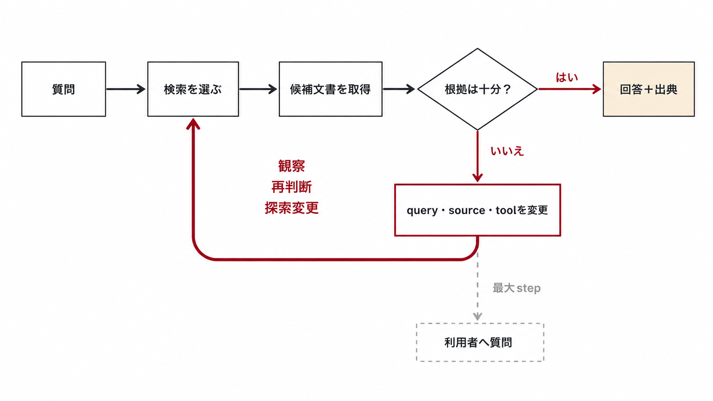
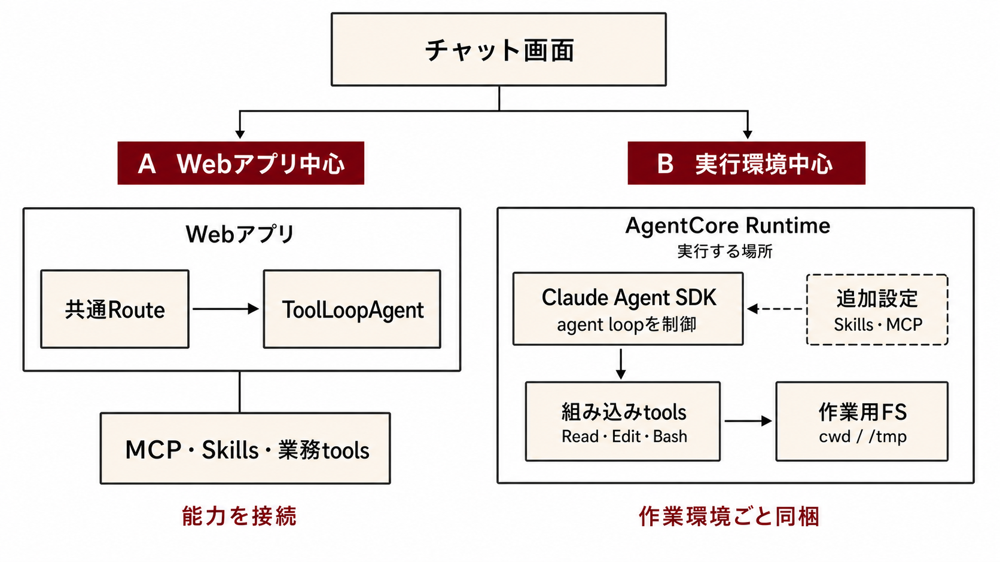
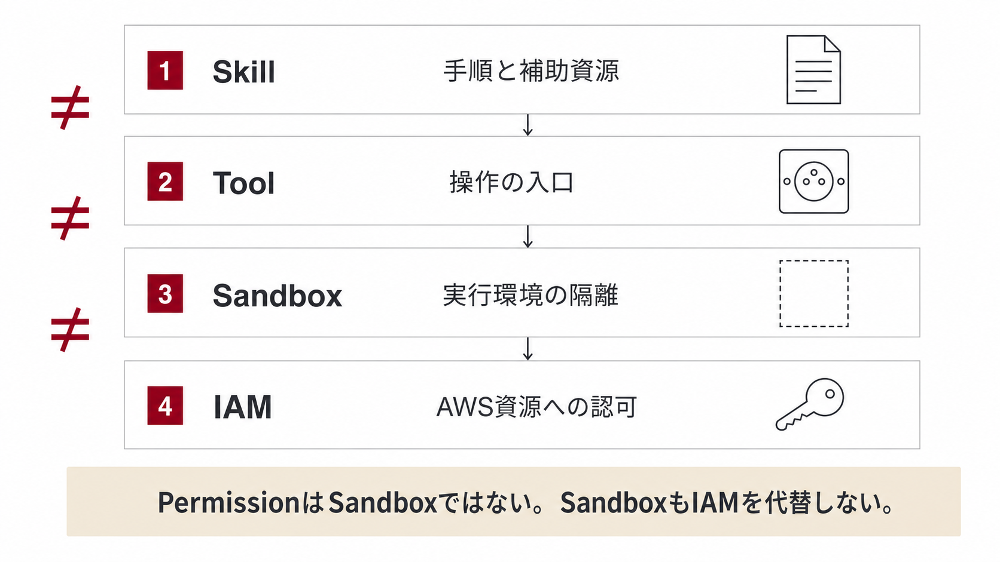
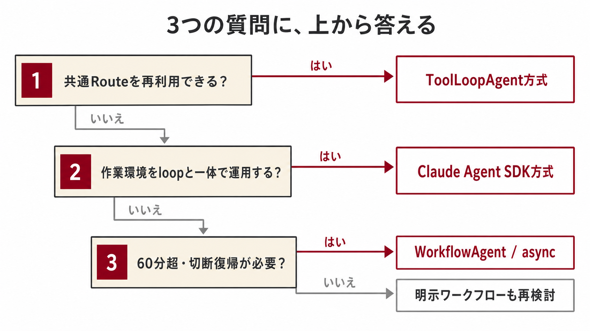

<div class="flex h-full flex-col justify-between">

<div class="flex items-center justify-between">
  <div class="muji-kicker">AIエージェント開発</div>
  <div class="muji-meta">2026 · 08 · TSUBOI HIROKI</div>
</div>

<div>
  <div class="muji-eyebrow mb-4">動く実物から学ぶ</div>
  <h1>AIエージェントの<br>作り方</h1>
  <div class="muji-red-rule mt-7"></div>
  <p class="mt-6 text-xl max-w-[50rem]">
    社内AIワークスペースが採用した ToolLoopAgent と Claude Agent SDK<br>
    <span class="text-base text-[#6d6d72]">まずループが回る様子、次に実物のコード、最後に選び方</span>
  </p>
</div>

</div>

<!--
外部の開発者が、エージェントの構成要素と作り方、2方式の違いと選択基準を理解するための資料。発表時間30分・全17枚（約1.75分/枚）。
構成方針: 冒頭にループの実況 → 定義 → 作り方A（実物のレジストリエントリ）→ 作り方B → 選び方 → 参照実装の現在地（免責はここに集約）。

[Sources]
- 参照実装リポジトリ 対象commit: develop@e33b41bea233d00e4c6b92da024e12cc412abcf5（2026-08-07）。以降のノートで repo: と書いたパスはこのcommitを指す
-->

---
layout: default
class: diagram-slide diagram-crop
---

<div class="muji-eyebrow mb-3">まず、動く瞬間を見る</div>

# エージェントは、結果を見て「もう一手」を選び直す

<div class="muji-diagram-frame">
  
</div>

<!--
掴みの1枚。ワークフローとの違いを言葉で説明する前に、ループが2周回る様子を見せる。
「2手目は誰も指示していない」が本資料の最重要文。

[Sources]
- repo:frontend/app/api/chat/histories/[historyId]/agent/route.ts（ToolLoopAgentのループ実行）
- repo:frontend/app/api/chat/histories/[historyId]/agent/agentRegistry.ts（rag-agent定義。finishTextStrategy last-or-steps で検索実況は最終回答から除外）
- https://ai-sdk.dev/docs/agents/overview
-->

---
layout: default
---

<div class="muji-eyebrow mb-3">なぜエージェントを作るのか</div>

# 次の一手を固定できない仕事に、エージェントを使う

<div class="grid grid-cols-2 gap-12 mt-8">

<div class="border-t border-[#3c3c43] pt-5">
  <div class="muji-label">手順を先に書ける</div>
  <div class="text-2xl font-bold mt-3">明示ワークフロー</div>
  <p class="mt-4">可能な経路・分岐・失敗時の処理をアプリで定義できる。<code>generateText</code> / <code>streamText</code> を順次・並列に構成する。信頼性と再現性を優先する仕事に向く。</p>
  <div class="grid grid-cols-[1fr_auto_1fr_auto_1fr] items-center gap-3 mt-6 text-center">
    <div class="muji-arch-box">入力</div><div class="muji-arch-arrow">→</div>
    <div class="muji-arch-box">決めた処理</div><div class="muji-arch-arrow">→</div>
    <div class="muji-arch-box">結果</div>
  </div>
</div>

<div class="border-t border-[#3c3c43] pt-5">
  <div class="muji-label">途中結果で選び直す</div>
  <div class="text-2xl font-bold mt-3">エージェント</div>
  <p class="mt-4">モデルがtool結果を見て、次の操作や完了を判断する。開発者が書くのは境界 — 役割・tools・停止・承認。経路を事前に列挙し切れない仕事に向く。</p>
  <div class="grid grid-cols-[1fr_auto_1fr_auto_1fr_auto] items-center gap-3 mt-6 text-center">
    <div class="muji-arch-box">モデル</div><div class="muji-arch-arrow">→</div>
    <div class="muji-arch-box">tool</div><div class="muji-arch-arrow">→</div>
    <div class="muji-arch-box">結果</div><div class="muji-arch-arrow">↺</div>
  </div>
</div>

</div>

<div class="muji-callout mt-8"><strong>固定手順で目的を満たせるなら、まずワークフロー。</strong><span class="muji-small ml-2">違いはAPIの能力ではなく、制御を書く場所。toolsもHITL（toolApproval）も generateText / streamText で使える。</span></div>

<!--
定義は1枚に圧縮。「制御を置く場所」の議論は口頭で補足。
想定質問「ツールやHITLはエージェント専用か」への答え: いいえ。tools / stopWhen / toolApproval は generateText・streamText 両方のオプションに実在（ai@7.0.19 型定義で確認）。ToolLoopAgentはそれらを束ねた包みで、能力の追加ではない。参照実装の通常チャットも streamText + isStepCount(1) を使っている（ループを閉じた使い方）。

[Sources]
- https://ai-sdk.dev/docs/agents/overview
- https://ai-sdk.dev/docs/agents/workflows
- https://ai-sdk.dev/docs/agents/loop-control
-->

---
layout: default
---

<div class="muji-eyebrow mb-3">設計の言語化</div>

# SDKを選ぶ前に、6つの観点を言葉にする

<div class="grid grid-cols-3 gap-x-8 gap-y-8 mt-8">

<div class="border-t border-[#3c3c43] pt-4"><div class="muji-label">役割</div><div class="font-bold mt-2">何を任せるか</div><p class="muji-small mt-2">目的、対象利用者、対応しない範囲</p></div>
<div class="border-t border-[#3c3c43] pt-4"><div class="muji-label">指示</div><div class="font-bold mt-2">どう振る舞うか</div><p class="muji-small mt-2">判断規則、出力形式、対話方針</p></div>
<div class="border-t border-[#3c3c43] pt-4"><div class="muji-label">知識</div><div class="font-bold mt-2">何を参照するか</div><p class="muji-small mt-2">RAG、添付、メモリ、Skills</p></div>
<div class="border-t border-[#3c3c43] pt-4"><div class="muji-label">ツール</div><div class="font-bold mt-2">何を実行できるか</div><p class="muji-small mt-2">検索、更新、ファイル、コード実行</p></div>
<div class="border-t border-[#3c3c43] pt-4"><div class="muji-label">ループ</div><div class="font-bold mt-2">いつ考え直すか</div><p class="muji-small mt-2">tool → result → 再判断 → 完了</p></div>
<div class="border-t border-[#3c3c43] pt-4"><div class="muji-label">安全と運用</div><div class="font-bold mt-2">どう制御するか</div><p class="muji-small mt-2">認可、承認、状態、監視、失敗処理</p></div>

</div>

<div class="muji-panel-kinari mt-8"><strong>この6観点は、そのまま作り方の手順になる。</strong><span class="muji-small ml-2">以降の手順スライドに担当観点を刻印し、最後に記入例へ戻る。</span></div>

<!--
伏線の宣言。A/B各手順スライドの右上に「観点」トークンを刻印し、作り方Aの最後（社内文書検索の記入例）で回収する。

[Sources]
- https://ai-sdk.dev/docs/agents/building-agents
- https://code.claude.com/docs/en/agent-sdk/overview
- https://github.com/agentskills/agentskills/blob/main/docs/specification.mdx
-->

---
layout: default
class: diagram-slide
---

<div class="muji-eyebrow mb-3">参照実装に見る2方式</div>

# 同じチャット画面でも、送信後の経路が違う

<div class="muji-diagram-frame">
  
</div>

<!--
[Sources]
- repo:frontend/app/(authenticated)/(chat)/_utils/chatTransport/chatTransport.ts（selectedAgentで endpoint 切替。general系はAgentCore直呼び）
- repo:frontend/app/api/chat/histories/[historyId]/agent/route.ts
- repo:runtime/general-agent/agent.py
-->

---
layout: default
class: agent-addition-slide
---

<div class="flex items-center justify-between mb-3">
  <div class="muji-eyebrow">作り方A · 全体像</div>
  <div><span class="muji-token">観点: 役割</span></div>
</div>

# 専門エージェントは「定義」して「公開」する

<div class="agent-addition-map">

<div class="agent-addition-lane">
  <div class="agent-addition-head"><strong>実装する</strong><span>3ファイル</span></div>
  <div class="agent-code-grid">
    <div class="agent-code-card">
      <div class="agent-code-label">01 · ID <span>agents.ts</span></div>
      <pre class="agent-mini-code"><code>const AGENT_IDS = [
  …,
  "sample-agent",
] as const;</code></pre>
      <div class="agent-code-meaning">リクエスト型に追加</div>
    </div>
    <div class="agent-code-card">
      <div class="agent-code-label">02 · 指示 <span>promptTemplate.ts</span></div>
      <pre class="agent-mini-code"><code>const rules = `
sample_echo ツールで
入力をそのまま復唱`;</code></pre>
      <div class="agent-code-meaning">役割と判断規則を書く</div>
    </div>
    <div class="agent-code-card">
      <div class="agent-code-label">03 · 接続 <span>agentRegistry.ts</span></div>
      <pre class="agent-mini-code"><code>buildSystemPromptParts: …,
buildRuntimeTools: …,
tools: { sample_echo: … }</code></pre>
      <div class="agent-code-meaning">指示とツールを束ねる</div>
    </div>
  </div>
  <div class="agent-flow-arrow"><span>↓</span> 3つの定義を読み込む</div>
  <div class="agent-common-route"><strong>共通 route.ts</strong><span>変更しない</span><small>ループ · HITL · ストリーミング · 履歴保存</small></div>
  <div class="agent-flow-result"><span>結果</span><strong>チャット応答 ＋ sample_echo を実行</strong></div>
</div>

<div class="agent-addition-lane agent-publish-lane">
  <div class="agent-addition-head"><strong>公開する</strong><span>seed 1件</span></div>
  <div class="agent-code-card agent-seed-card">
    <div class="agent-code-label">04 · 表示と権限 <span>variables.tf</span></div>
    <pre class="agent-mini-code"><code>{
  id        = "sample-agent"
  enabled   = true
  privilege = "user"
}</code></pre>
    <div class="agent-code-meaning">表示するか・誰が使えるかを決める</div>
  </div>
  <div class="agent-flow-arrow"><span>↓</span> /api/agents が取得</div>
  <div class="agent-menu-result"><strong>画面のメニューに表示</strong><small>利用者の privilege もここで判定</small></div>
</div>

</div>

<div class="agent-done-row"><span>完成条件</span><strong>メニューに出る</strong><i>→</i><strong>選んで話せる</strong><i>→</i><strong>ツールが動く</strong><small>Step 5–7: check / test → 画面確認 → 能力マトリクス更新</small></div>

<!--
実ガイドのDoDと三層構造を、コード定義とDynamoDB公開の2経路に分けて図解。sample-agentはガイド上のチュートリアル例で、実リポジトリにはコミットしない前提。

[Sources]
- repo:documents/エージェント追加手順ガイド.md（0章DoD、1.1三層構造、3.1〜3.7のsample-agentチュートリアル）
- repo:frontend/schemas/api/agents.ts（AGENT_IDS の実体はここ）
-->

---
layout: default
---

<div class="flex items-center justify-between mb-3">
  <div class="muji-eyebrow">作り方A · レジストリエントリ</div>
  <div><span class="muji-token">観点: 指示・知識・ツール</span></div>
</div>

# 実物はこの1エントリ — ガイド掲載のチュートリアル

<div class="grid grid-cols-[1.15fr_0.85fr] gap-9 mt-4">

```ts
"sample-agent": {
  buildSystemPromptParts: (ctx) =>
    createSampleAgentSystemPromptParts(
      ctx.company, withPromptOptions(ctx)),
  catalog: "visualization",
  gateways: [], // MCP接続キー。例: ["kr-dashboard"]
  safeToolPatterns: [], // HITL免除。例: ["rag_retrieve"]
  hasReferences: false,
  telemetryAgentName: "sample_agent",
  titleTelemetryTag: "sample_agent_title_generation",
  buildRuntimeTools: async () => ({
    tools: { sample_echo: sampleEchoTool },
    client: null,
  }),
},
```

<div>
  <div class="border-t border-[#3c3c43] py-3"><div class="font-bold">buildSystemPromptParts</div><div class="muji-small">指示。static / dynamic 分離 — static はキャッシュされるため変動値禁止</div></div>
  <div class="border-t border-[#3c3c43] py-3"><div class="font-bold">gateways / buildRuntimeTools</div><div class="muji-small">gateways は接続するMCP Gatewayのキー一覧。キーから別設定のURL環境変数を引き、toolsを取得する。buildRuntimeTools はローカルTS tool等の注入点</div></div>
  <div class="border-t border-[#3c3c43] py-3"><div class="font-bold">safeToolPatterns</div><div class="muji-small">HITL承認を免除するtool名の部分一致パターン。空なら update / delete / create 等をtool名から自動判定</div></div>
  <div class="border-t border-[#3c3c43] py-3"><div class="font-bold">telemetryAgentName</div><div class="muji-small">観測。Langfuseタグの元になる</div></div>
</div>

</div>

<div class="muji-callout mt-4"><strong>宣言を1個書けば、専門エージェントが1体増える。</strong><span class="muji-small ml-2">最小の実例: kr-dashboard-agent（単一gateway・フォーム系）。</span></div>

<!--
「作れそう」を作る中心スライド。これはガイドのチュートリアル（sample-agent）に掲載されている実エントリで、創作ではない。最小の実例は kr-dashboard-agent（単一gateway・フォーム系）。新しい能力を作る前に、既存のtoolとSkillを探すのが原則。
想定質問「AgentCoreがS3やDynamoのツールを提供する？」への答え: 提供するのはGatewayによる「ツール化と配布」。既製コネクタではなく、実装（boto3等）とIAMは自作Lambda側。AgentCore自身の組み込みツールはCode InterpreterとBrowserの2つのみ。Runtimeはツール提供者ではなく実行環境。

[Sources]
- repo:documents/エージェント追加手順ガイド.md（3.3 Step 3のエントリ本体をそのまま掲載。4章にツール接続の3パターン）
- repo:frontend/app/api/chat/histories/[historyId]/agent/agentRegistry.ts
- repo:terraform/modules/agentcore/aiws_dynamodb_gateway/main.tf（aws_bedrockagentcore_gateway + Lambda target + tool_schema）
-->

---
layout: default
---

<div class="flex items-center justify-between mb-3">
  <div class="muji-eyebrow">作り方A · 共通Routeの内側</div>
  <div><span class="muji-token">観点: ループ・安全と運用</span></div>
</div>

# ループと安全は、共通Routeが引き受ける

<div class="grid grid-cols-[1.15fr_0.85fr] gap-9 mt-4">

```ts
new ToolLoopAgent({
  id: `mhi-${agentType}`,
  model: languageModel,
  instructions: cachedSystemMessage,
  tools,
  stopWhen: isStepCount(maxSteps ?? 10),
  toolApproval: ({ toolCall }) =>
    destructiveToolNames.has(toolCall.toolName)
      ? "user-approval"
      : undefined,
  onStepEnd: observeStep,
})
```

<div>
  <div class="border-t border-[#3c3c43] py-3"><div class="font-bold">instructions</div><div class="muji-small">役割と判断規則。static部分はキャッシュ</div></div>
  <div class="border-t border-[#3c3c43] py-3"><div class="font-bold">tools</div><div class="muji-small">MCP + Skills + ローカルの合成</div></div>
  <div class="border-t border-[#3c3c43] py-3"><div class="font-bold">stopWhen</div><div class="muji-small">step上限。既定10、リクエストで1〜20</div></div>
  <div class="border-t border-[#3c3c43] py-3"><div class="font-bold">toolApproval</div><div class="muji-small">update / delete 等の破壊的キーワードにtool名が部分一致したら承認で止める。safeToolPatternsで免除</div></div>
</div>

</div>

<div class="mt-5"><strong>Routeが同時に引き受けるもの:</strong>
  <span class="muji-token ml-2">認証・認可</span><span class="muji-token">ストリーミング</span><span class="muji-token">会話履歴</span><span class="muji-token">承認UI</span><span class="muji-token">成果物保存</span><span class="muji-token">観測</span>
</div>

<!--
コードは route.ts の実装の要約（実物は providerOptions・prepareStep・telemetry設定などが続く）。isStepCount は AI SDK 7 の正式API（v5/v6 の stepCountIs は旧名）。
HITL は「承認リストを列挙する」のではなく、破壊的キーワードの部分一致で自動判定し、safeToolPatterns で免除する方向。

[Sources]
- repo:frontend/app/api/chat/histories/[historyId]/agent/route.ts（ToolLoopAgent生成）
- repo:frontend/app/api/chat/histories/[historyId]/_utils/hitlUtils.ts（DESTRUCTIVE_TOOL_PATTERNS 部分一致）
- https://ai-sdk.dev/docs/reference/ai-sdk-core/tool-loop-agent
-->

---
layout: default
class: compact-matrix
---

<div class="muji-eyebrow mb-3">作り方A · 観点の記入例</div>

# 冒頭の実況は、この宣言から生まれる

| 観点 | 社内文書検索エージェントでは |
|---|---|
| 役割 | 規程・社内文書のQ&A。申請の実行はしない |
| 指示 | 出典を必ず付ける。プロンプトは static / dynamic 分離 |
| 知識 | RAGインデックス。必要時にSkillsを読み込む |
| ツール | `rag_retrieve`（読み取りのみ。破壊的キーワード非該当で承認不要） |
| ループ | 共通Routeの ToolLoopAgent。上限10 step、足りなければ再検索 |
| 安全と運用 | 公開範囲はDBの privilege。実行はLangfuseで観測 |

<div class="muji-callout mt-5"><strong>6観点が言葉になっていれば、方式（A/B）は後から替えられる。</strong></div>

<!--
6観点の伏線回収。冒頭の模式トレース（再検索が1回入る）は、この表の宣言だけで成立する — 手順は書いていない。

[Sources]
- repo:frontend/app/api/chat/histories/[historyId]/agent/agentRegistry.ts（rag-agent）
- repo:documents/エージェント追加手順ガイド.md
-->

---
layout: default
---

<div class="flex items-center justify-between mb-3">
  <div class="muji-eyebrow">作り方B · 全体像</div>
  <div><span class="muji-token">観点: 役割</span></div>
</div>

# エージェント固有と、共有基盤を分ける

<div class="grid grid-cols-[0.95fr_1.05fr] gap-10 mt-5">

```text
runtime/
├── shared/chat/          # 全エージェント共有
│   ├── server_app.py     # HTTP入口
│   ├── runtime_app.py    # agent loop起動
│   ├── auth.py           # JWT検証 + privilege認可
│   ├── hitl.py           # 承認queue
│   └── session_store.py  # S3 transcript
└── general-agent/
    ├── server.py         # エントリポイント
    ├── agent.py          # ClaudeAgentOptions
    ├── system_prompt.py
    ├── skills/s3-upload/
    ├── .claude/settings.json
    ├── requirements.txt
    └── Dockerfile
```

<div>
  <div class="border-t border-[#3c3c43] py-4"><div class="font-bold">共有基盤</div><div class="muji-small">HTTP入口、認証・認可、agent loop起動、承認queue、状態保存、イベント変換</div></div>
  <div class="border-t border-[#3c3c43] py-4"><div class="font-bold">エージェント固有</div><div class="muji-small">model、prompt、Skills、権限、依存ライブラリ、コンテナ</div></div>
  <div class="muji-panel-kinari mt-5"><strong>差し替えるのは設定。再実装しないのはループ。</strong><br><span class="muji-small">同じ基盤で2体目のエージェントが既に稼働している — 基盤は使い回せる。</span></div>
</div>

</div>

<!--
Claude Agent SDKと作業環境を、ひとつの公開単位にまとめる方式。ツリーは実構成（server.py = Dockerfile の ENTRYPOINT、認可の中核 auth.py を含む）。
「2体目」= mi-agent。同じ shared/chat 基盤＋独自Skills＋PostToolUse Hookで稼働中。

[Sources]
- repo:runtime/general-agent/README.md
- repo:runtime/shared/chat/（server_app.py / runtime_app.py / auth.py / hitl.py / session_store.py）
- repo:runtime/general-agent/Dockerfile（ENTRYPOINT ["python", "server.py"]）
- https://code.claude.com/docs/en/agent-sdk/hosting
-->

---
layout: default
---

<div class="flex items-center justify-between mb-3">
  <div class="muji-eyebrow">作り方B · 設定</div>
  <div><span class="muji-token">観点: 指示・知識・ツール</span></div>
</div>

# ClaudeAgentOptionsで実行条件をまとめる

<div class="grid grid-cols-[1.1fr_0.9fr] gap-9 mt-4">

```py {2-14}
# 実装抜粋（要約）
options = ClaudeAgentOptions(
    model=model_id,
    system_prompt={
        "type": "preset", "preset": "claude_code",
        "append": build_prompt(session_id),
    },
    setting_sources=["project"],
    skills=["s3-upload"],
    permission_mode="default",
    disallowed_tools=["WebFetch"],
    can_use_tool=make_can_use_tool(
        session_id, web_search_always_hitl=True,
    ),
    cwd="/app",
)
```

<div>
  <div class="border-t border-[#3c3c43] py-4"><div class="font-bold">model / prompt</div><div class="muji-small">役割と判断規則</div></div>
  <div class="border-t border-[#3c3c43] py-4"><div class="font-bold">settings / skills</div><div class="muji-small">project設定と専門手順を読み込む</div></div>
  <div class="border-t border-[#3c3c43] py-4"><div class="font-bold">permissions</div><div class="muji-small">allow・deny・人への確認</div></div>
  <div class="border-t border-[#3c3c43] py-4"><div class="font-bold">cwd / container</div><div class="muji-small">作業場所と依存環境</div></div>
</div>

</div>

<div class="muji-small mt-3">実物はさらに thinking・mcp_servers・sessionの再開（resume）の配線が続く。</div>

<!--
[Sources]
- repo:runtime/general-agent/agent.py（ClaudeAgentOptions構築。skills / can_use_tool(web_search_always_hitl=True) / disallowed_tools=["WebFetch"] / cwd="/app" は実値）
- https://code.claude.com/docs/en/agent-sdk/python
- https://code.claude.com/docs/en/agent-sdk/permissions
-->

---
layout: default
---

<div class="flex items-center justify-between mb-3">
  <div class="muji-eyebrow">作り方B · 能力と接続</div>
  <div><span class="muji-token">観点: ツール・ループ</span></div>
</div>

# 同じ環境で道具を使い、イベントをUIへ返す

<div class="grid grid-cols-3 gap-7 mt-6">

<div class="border-t border-[#3c3c43] pt-4">
  <div class="muji-label">組み込みツール</div>
  <div class="text-lg font-bold mt-2">Read · Edit · Write<br>Glob · Grep · Bash</div>
  <p class="muji-small mt-2">同じファイルシステムで調査と変更を反復。作業場所は/tmp、アプリ本体への書込は禁止。</p>
</div>

<div class="border-t border-[#3c3c43] pt-4">
  <div class="muji-label">スキル</div>
  <div class="text-lg font-bold mt-2">s3-upload</div>
  <p class="muji-small mt-2">/tmpの成果物をS3へ上げ、期限付きURLを1行返す手順書。</p>
</div>

<div class="border-t border-[#3c3c43] pt-4">
  <div class="muji-label">外部検索</div>
  <div class="text-lg font-bold mt-2">MCPツール + 毎回承認</div>
  <p class="muji-small mt-2">検索はMCPツールとして接続し毎クエリHITL。組み込みWebFetch / WebSearchは使わせない。</p>
</div>

</div>

<div class="muji-arch-lane muji-arch-lane-four mt-8">
  <div class="muji-arch-box"><span>ブラウザ</span><br><strong>POST /invocations</strong></div><div class="muji-arch-arrow">→</div>
  <div class="muji-arch-box"><span>AgentCore</span><br><strong>JWT・session</strong></div><div class="muji-arch-arrow">→</div>
  <div class="muji-arch-box"><span>Agent SDK</span><br><strong>stream events</strong></div><div class="muji-arch-arrow">→</div>
  <div class="muji-arch-box"><span>フロントエンド</span><br><strong>UI表示用に変換</strong></div>
</div>

<!--
検索の実体: Vertex AI Grounding を in-process MCP server として接続（ツール名 mcp__web_search__search）。組み込みWebSearchはdeny、WebFetchはdisallowed_toolsでコンテキストから除去。承認・回答は同じsticky sessionへの別POSTで届く。

[Sources]
- repo:runtime/general-agent/.claude/settings.json（allow/deny。/app書込deny）
- repo:runtime/general-agent/skills/s3-upload/SKILL.md
- repo:runtime/shared/chat/hitl.py（web_search_always_hitl）
- repo:frontend/lib/general-agent/transport.ts（SSE→UIMessageChunk変換）
-->

---
layout: default
class: diagram-slide
---

<div class="flex items-center justify-between mb-3">
  <div class="muji-eyebrow">作り方B · 公開と運用</div>
  <div><span class="muji-token">観点: 安全と運用</span></div>
</div>

# ひとつの実行サービスとして公開する

<div class="muji-diagram-frame">
  
</div>

<!--
Runtimeはツール提供者ではなく実行環境（箱）。Gatewayはツール化と配布。中のコードは実行roleのIAMでAWS資源を直接叩くため、隔離と認可を別々に設計する。

[Sources]
- repo:runtime/general-agent/Dockerfile（python:3.12-slim digest固定 / claude-code CLI固定 / DISABLE_AUTOUPDATER=1）
- repo:runtime/general-agent/requirements.txt（claude-agent-sdk==固定、他はrange）
- repo:runtime/shared/chat/session_store.py（S3 transcript）
- https://docs.aws.amazon.com/bedrock-agentcore/latest/devguide/runtime-security-best-practices.html
- https://code.claude.com/docs/en/agent-sdk/secure-deployment
-->

---
layout: default
class: diagram-image-only
---

<div class="muji-eyebrow mb-3">判断の順序</div>

<div class="muji-diagram-frame">
  
</div>

<!--
60分は「ストリーミング接続」の上限（セッション寿命は別枠で最大8時間）。長時間・中断耐性は AI SDK 7 の WorkflowAgent か AgentCore の async 化で別に設計する。

[Sources]
- https://docs.aws.amazon.com/bedrock-agentcore/latest/devguide/bedrock-agentcore-limits.html（Streaming maximum duration 60 mins / Request timeout 15 min / Asynchronous job 8 hours）
- https://ai-sdk.dev/docs/agents/workflow-agent
- https://vercel.com/blog/ai-sdk-7
-->

---
layout: default
---

<div class="muji-eyebrow mb-3">参照実装の現在地</div>

# 手本の範囲を、3列で確かめてから使う

<div class="grid grid-cols-3 gap-7 mt-7">

<div class="border-t border-[#3c3c43] pt-4">
  <div class="muji-label">動いているもの</div>
  <ul class="mt-3">
    <li>A方式で7つの専門エージェントが稼働</li>
    <li>B基盤は2エージェントで共用中</li>
    <li>承認・S3 transcript・観測は配線済み</li>
  </ul>
</div>

<div class="border-t border-[#3c3c43] pt-4">
  <div class="muji-label">未接続（拡張の余地）</div>
  <ul class="mt-3">
    <li>A: 汎用Bash・Vercel Sandbox・Code Interpreter</li>
    <li>B: max_turns・max_budget_usd・custom subagents</li>
    <li>Hooksは2体目のエージェントで使用中</li>
  </ul>
</div>

<div class="border-t border-[#3c3c43] pt-4">
  <div class="muji-label">本番化前の必須差分</div>
  <ul class="mt-3">
    <li>session所有者照合（session IDは信頼境界でないとコード自身が明記）</li>
    <li>stream reconnect（切断・リロード復帰）</li>
    <li>依存のlock</li>
  </ul>
</div>

</div>

<div class="muji-callout mt-8"><strong>免責はこの1枚に集約した。コピーする前に、この3列を読む。</strong></div>

<!--
各スライドに散らしがちな「未接続」「未実装」をここに集約。安全上とくに重要なのは session所有者照合（auth.py の docstring が「session_id は信頼境界ではない」「他人の chatHistoryId」リスクを明記）と reconnect（transport.ts の reconnectToStream は未対応と明記）。

[Sources]
- repo:runtime/shared/chat/auth.py（session IDの信頼境界に関する自認コメント）
- repo:frontend/lib/general-agent/transport.ts（reconnectToStream 未対応）
- repo:runtime/mi-agent/.claude/settings.json（PostToolUse Hook使用中）
- https://code.claude.com/docs/en/agent-sdk/python（max_turns / max_budget_usd は実在するSDKパラメータ）
-->

---
layout: default
class: closing-slide
---

<div class="muji-kicker mb-7">まとめ</div>

# エージェントは<br>必要な仕事だけに使う

<div class="grid grid-cols-3 gap-6 mt-10 max-w-[59rem]">
  <div class="border-t border-[#3c3c43] pt-4"><div class="muji-number">1</div><div class="font-bold mt-2">経路を定義できるなら明示ワークフロー</div></div>
  <div class="border-t border-[#3c3c43] pt-4"><div class="muji-number">2</div><div class="font-bold mt-2">次の一手を任せるなら、境界を書いたagent loop</div></div>
  <div class="border-t border-[#3c3c43] pt-4"><div class="muji-number">3</div><div class="font-bold mt-2">共通Routeに足すか、実行環境ごと作るか</div></div>
</div>

<div class="muji-meta mt-10">ループが2周回る様子を見せられれば、エージェントは説明できる</div>

<!--
[Sources]
- https://ai-sdk.dev/docs/agents/overview
- https://ai-sdk.dev/docs/reference/ai-sdk-core/tool-loop-agent
- https://code.claude.com/docs/en/agent-sdk/overview
-->

---
layout: default
---

<div class="muji-eyebrow mb-3">参考資料</div>

# 参考資料

<div class="grid grid-cols-2 gap-10 mt-6">

<div>
  <div class="muji-label mb-2">調査対象（参照実装リポジトリ内）</div>
  <ul class="muji-source-list">
    <li>対象commit: <code>develop@e33b41bea233d00e4c6b92da024e12cc412abcf5</code></li>
    <li>documents/エージェント追加手順ガイド.md</li>
    <li>runtime/general-agent/README.md（Runtime仕様）</li>
    <li>runtime/shared/chat/auth.py（session IDの信頼境界）</li>
  </ul>
</div>

<div>
  <div class="muji-label mb-2">公式ドキュメント</div>
  <ul class="muji-source-list">
    <li><a href="https://ai-sdk.dev/docs/agents/overview">AI SDK · Agents / Structured Workflows</a></li>
    <li><a href="https://ai-sdk.dev/docs/agents/workflow-agent">AI SDK · ToolLoopAgent / WorkflowAgent</a></li>
    <li><a href="https://github.com/agentskills/agentskills/blob/main/docs/specification.mdx">Agent Skills仕様</a></li>
    <li><a href="https://code.claude.com/docs/en/agent-sdk/secure-deployment">Claude Agent SDK · Secure Deployment</a></li>
    <li><a href="https://docs.aws.amazon.com/bedrock-agentcore/latest/devguide/runtime-security-best-practices.html">AgentCore Runtime · Security</a></li>
    <li><a href="https://docs.aws.amazon.com/bedrock-agentcore/latest/devguide/bedrock-agentcore-limits.html">AgentCore Runtime · Quotas</a></li>
  </ul>
</div>

</div>

<div class="muji-panel-kinari mt-7"><div class="muji-small">公式docs再確認: 2026-08-13 · 実装の記述はすべて対象commit時点</div></div>

<!--
[Sources]
- 参照実装リポジトリ 対象commit: develop@e33b41bea233d00e4c6b92da024e12cc412abcf5
- 上記スライド記載の公式ドキュメント各URL
-->
